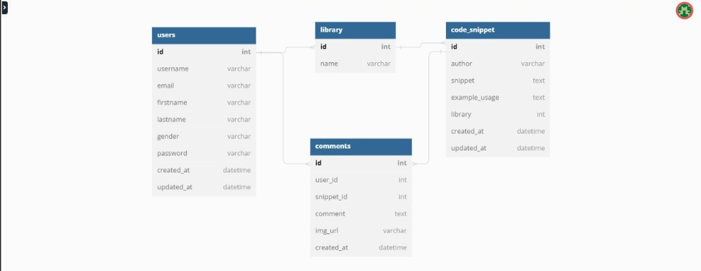

This is a solution to the [Project Phase , Milestone 1](https://w2pp.zuriboard.com/dashboard/team/148/task/45).

## Task Title: Documentation, Design Sketch

- [Overview](#overview)
  - [Resources](#Resources)
- [Autheticated Users](#Autheticated-Users)
  - [Un-Authenticated-users](#Un-Authenticated-users) 
  - [Database-Schema](#Database-Schema) 
  
- [TOOLS](#TOOLS)
- [Team Members](#Meet-Our-Team)
- [Author](#Author)
- [Acknowledgments](#Acknowledgments)

## Overview

A website by the name of AuthWiki offers a library of
authentication codes, explains each code in great depth,
and provides examples of how the codes operate.
Through AuthWiki, users have access to a community. In Auth-Wiki,
there are two types of users:
* Unauthenticated users and
* Authenticated users.

The unauthenticated user is only able to view and interact
with the documentation, browse the library in part,
access the most basic website information, and cannot download
code samples. The authenticated user, on the other hand, has
total access to the website and has the ability to contribute
via remarks and responses, view example usages, and download
code samples.
A non-registered user needs to sign up in order to have full access.

### Resources

 -[User-Research](https://www.figma.com/file/LJ5wmuoeKKIy59ENkW4nwM/USER-RESEARCH-(TEAM-PARROT)?node-id=0%3A1&t=iBcPUzWceGbFRBPE-1)
 - [Figma-Design](https://www.figma.com/file/sND8VLhfgWLIyNkJ5jTLeG/Team-Parrot?t=iBcPUzWceGbFRBPE-1)
  - [Style Guide]()
 - [Design-Sketch](https://www.figma.com/file/sND8VLhfgWLIyNkJ5jTLeG/Team-Parrot?node-id=186%3A75&t=tlVN5wBtH8bEtc73-1)

### Authenticated-users
- Full access to the plaftorm
- contribute, however, contribution should be limited to comments and reactions
- Able to view example usage
- Download code samples
### Un-Authenticated-users
- Visit the plaftorm to view basic information about it
- View and interact with the documentation
- Register to contribute
- Browse through library with limited information, download should not be available
### Database-Schema

The Backend Team Made tables/entities first:

User
Library
Comment
Code_snippets

Decided what attribute each was to have and assigned a private key or id to each table

Next worked on relationships between the tables.

User has a one to one  relationships with profile (user_id)

User has a one to many  relationships with comments and library (snippet_id, the library's id)

Library has a one to many  relationships with code_snippet and comments

Comments has a one to many  relationships with code_snippets

## TOOLS

- **Figma**
- **Django**
- **VSCode**
- **Python**
- **Pen**
- **Paper**

## Meet Our Team

1. Rukayat Lamidi -- Product Design
2. Bright Uwaoma -- Product Design
3. Margaret Ekerendu -- Product Design
4. Ebubechukwu Ijezie-- Product Design
5. Ali Abdul-Quadir --  Product Design
6. Ige Jide  -- Product design
7. Loveth Iniovoghare -- Product Design
8. Damilola Bilewu -- Product Design
9. Dorcas Abraham -- Product Design
10. Akinde Oluwadamilola -- Product Design
11. Oluwatimilehin Erinle -- Full stack Developer (Python)
12. Oluwaseun Akanji -- FullStack Developer (Python)
13. Khadija Danhassan - Fullstack Python
14. Onokwakpor Oghenekparobo -- Frontend
15. Francis Chukwuoma -- Backend Python
16. Oyepitan Fortune --Backend Python
17. Henry Ugwu -- Full stack python
18. Morah Chukwuemeka - Full stack python

## Author

 [Team-Parrot](https://github.com/zuri-training/Auth_wiki-Team-Parrot)

## Acknowledgments

Big Big respect to the Zuri Team
